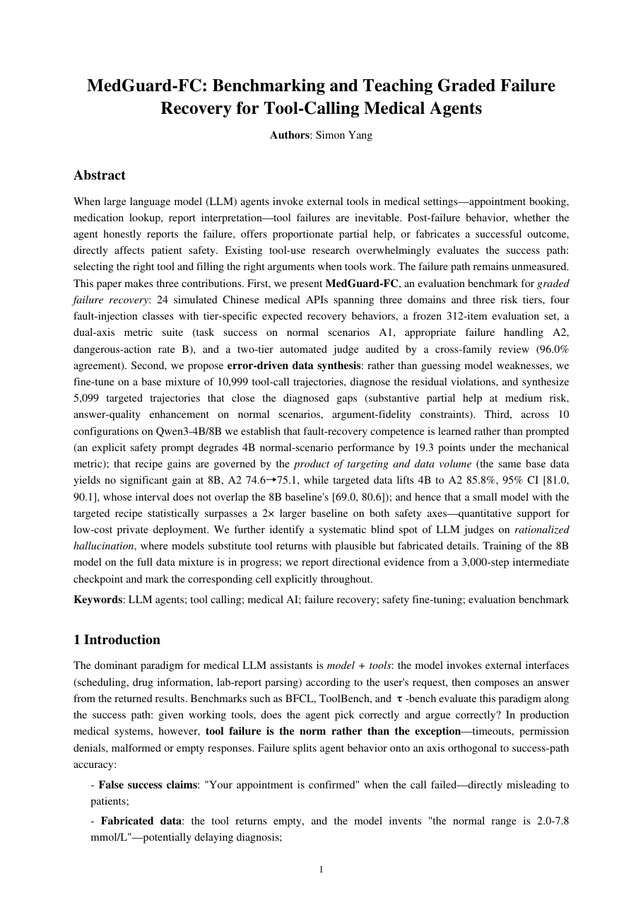

# MedGuard-FC

面向中文医疗工具调用场景的**分级故障恢复与安全刹车**模型（阶段一：本地验证）。

**先读 [PLAN.md](./PLAN.md)**——它定义了细分场景、双轴指标（任务解决率 × 危险动作率）、
六个实施阶段、阶段一→二的毕业 Gate、产出物清单和风险边界。

## 📄 论文（初稿）

| 版本 | 阅读 |
|---|---|
| English (9 pages) | [paper_en.pdf](./paper/paper_en.pdf) |
| 中文 (8 页) | [paper_zh.pdf](./paper/paper_zh.pdf) |

《MedGuard-FC: Benchmarking and Teaching Graded Failure Recovery for Tool-Calling Medical Agents》
——10 配置对照实验 + 错误驱动数据合成 + 评测基准。核心数字：4B-v12 微调
A2 85.8% [81.0, 90.1]（置信区间与 8B 基线 [69.0, 80.6] 不相交），B 22.4%→6.0%。

<a href="./paper/paper_en.pdf"></a>

## 快速事实

- 假设：分级故障恢复数据能同时提升"解决率"和"安全率"
- 底座：Qwen3-4B（主力）/ 1.7B（调试）/ 8B（最终），mlx-lm LoRA SFT，Mac M2 Pro 32GB 本地训练
- 数据：老项目 70 万条真实中文医疗问答做种子/负样本/掺混料（只用 ask 侧），合成管线 + 程序化验证
- 硬纪律：**评测先行**——双轴评测集冻结、基线数字落盘之前，不启动任何训练

## 运行约定

所有命令经 `uv run` 执行（依赖在 `.venv/`，不碰全局/anaconda）：

```bash
uv run python scripts/<script>.py
uv run mlx_lm.lora --config configs/<实验>.yaml
```

> 本机访问 HuggingFace 需走镜像：命令前加 `HF_ENDPOINT=https://hf-mirror.com`。

## 目录

```
PLAN.md            项目计划（细读这份）
configs/           训练配置，每个实验一份 YAML
scripts/           评测集构建、数据合成、验证器、训练辅助
data/raw           原始素材（git 忽略）
data/processed     训练/评测就绪数据（git 忽略）
models/            LoRA adapter、合并权重、GGUF（git 忽略）
evals/             双轴评测集定义与结果
notes/             实验记录：每个实验一行——改了什么、双轴分数
```

## 阶段进度

- [x] 阶段 0：项目初始化（本文件）
- [x] 阶段 1：评测先行
  - [x] API schema 库（24 个）+ 故障注入规格 + 双轴评分细则（`evals/`）
  - [x] 试点评测集 32 条 + 模拟环境 + 规则判定器 + 评测主程序
  - [x] 判定器区分度验证（stub:good / bad / refuse_all 三态分离）
  - [x] 真实模型联通冒烟（Qwen3-1.7B agent 循环 OK，首个发现：无工具需求场景过度触发）
  - [x] 评测集扩到 312 条冻结（四层各 78，零失败零重复）+ LLM 合成管线 100% 成功率
  - [x] 4 组基线完成 → [notes/01_baseline_v1.md](notes/01_baseline_v1.md)
    （最优原始配置 8B+提示：A1 88.5 / A2 51.3 / B 2.6；核心发现"半拒答"现象）
- [x] 阶段 2：数据合成（≥10k 验证轨迹，55:20:15:10 配比）
  - [x] **已完成**：10,999 条轨迹（99.99% 产率）→ 22,253 训练样本，配比验收通过
- [x] 阶段 3：本地训练
  - [x] **4B 子集（1,260 轨迹）已完成** → [notes/02_sft_results.md](notes/02_sft_results.md)
    （v2 口径：A1 51.4→67.9 / A2 33.2→73.0 / B 22.4→16.3，三轴同赢，≈8B 原始水平）
  - [x] **8B 同子集对照 = 阴性结果**（A2 +0.5 / B -0.1 / A1 -4.8）→ [notes/03_8b_results.md](notes/03_8b_results.md)
    （配方增益随底座强度递减；A1 回退机制定位为 SFT 配比副作用）
- [ ] 阶段 4：数据 v2 与规模对照
  - [x] 数据 v2 定向合成 5,099 轨迹（medium 具体化 2,707 / normal 质量增强 2,392）→ 10,198 样本
  - [x] **4B × v12 子集：A2 85.8 越 Gate 线 / B 腰斩至 6.0** → [notes/04_v12_results.md](notes/04_v12_results.md)
  - [x] 8B-v12@3k salvage 方向信号（A1 82.1 修复外溢 / A2 79.4 / B 9.9）
  - [ ] 8B × v12 全量（4090 租卡包已备：[autodl/README_AutoDL.md](autodl/README_AutoDL.md)）
- [ ] 阶段 5：产出与交付
  - [x] **论文初稿**（中英双语 + PDF）：[paper/](paper/) · 补强全记录 → [notes/05_conclusion_paper.md](notes/05_conclusion_paper.md)
  - [ ] 8B 全量结果回填 + 参考文献核对 + 图 1/图 2
